# AutoAlarm Architecture: Post-Enrichment Design

## 1. High-Level System Architecture

```mermaid
graph TB
    subgraph "Source Account A (us-east-1)"
        EB_A["EventBridge<br/>(Default Bus)"]
        AA_A["AutoAlarm Lambda<br/>(creates/manages alarms)"]
        CW_A["CloudWatch Alarms<br/>AutoAlarm-*"]
        LOGS_A["CloudWatch Logs"]
        METRICS_A["CloudWatch Metrics"]
        OAM_LINK_A["OAM Link"]
        EB_RULE_A["EB Rule:<br/>Forward Alarm State Changes"]

        AA_A -->|PutMetricAlarm| CW_A
        CW_A -->|State Change Event| EB_A
        EB_A --> EB_RULE_A
    end

    subgraph "Source Account B (us-east-1)"
        EB_B["EventBridge<br/>(Default Bus)"]
        AA_B["AutoAlarm Lambda"]
        CW_B["CloudWatch Alarms<br/>AutoAlarm-*"]
        LOGS_B["CloudWatch Logs"]
        METRICS_B["CloudWatch Metrics"]
        OAM_LINK_B["OAM Link"]
        EB_RULE_B["EB Rule:<br/>Forward Alarm State Changes"]

        AA_B -->|PutMetricAlarm| CW_B
        CW_B -->|State Change Event| EB_B
        EB_B --> EB_RULE_B
    end

    subgraph "Hub/Monitoring Account (us-east-1)"
        subgraph "Event Ingestion"
            CENTRAL_BUS["EventBridge<br/>AutoAlarm-Central Bus"]
            EB_RULE_HUB["EB Rule:<br/>Match AutoAlarm-* ALARM"]
            ENR_QUEUE["Enrichment SQS Queue<br/>(FIFO)"]
        end

        subgraph "OAM Infrastructure"
            OAM_SINK["OAM Sink<br/>(AutoAlarm-OAM-Sink)"]
        end

        subgraph "Enrichment Pipeline"
            ENR_LAMBDA["Enrichment Lambda"]
            DEDUP["Idempotency Check<br/>(DynamoDB)"]
        end

        subgraph "Agent Layer (Optional)"
            AGENT["Bedrock AgentCore<br/>Agent Runtime"]
        end

        subgraph "Output"
            SNS["SNS Topic<br/>AutoAlarm-EnrichedAlarms"]
        end

        CENTRAL_BUS --> EB_RULE_HUB
        EB_RULE_HUB --> ENR_QUEUE
        ENR_QUEUE --> ENR_LAMBDA
        ENR_LAMBDA --> DEDUP
        ENR_LAMBDA -.->|Critical only| AGENT
        AGENT -.->|Summary| ENR_LAMBDA
        ENR_LAMBDA -->|Publish| SNS
    end

    subgraph "Downstream Consumers"
        PAGERDUTY["PagerDuty"]
        SLACK["Slack"]
        SERVICENOW["ServiceNow"]
        CUSTOM["Custom Automation"]
    end

    %% Cross-account event plane
    EB_RULE_A -->|PutEvents| CENTRAL_BUS
    EB_RULE_B -->|PutEvents| CENTRAL_BUS

    %% Cross-account data plane (OAM)
    OAM_LINK_A -->|Link| OAM_SINK
    OAM_LINK_B -->|Link| OAM_SINK
    ENR_LAMBDA -->|Read Metrics<br/>(via OAM)| METRICS_A
    ENR_LAMBDA -->|Read Metrics<br/>(via OAM)| METRICS_B
    ENR_LAMBDA -->|Logs Insights<br/>(via OAM)| LOGS_A
    ENR_LAMBDA -->|Logs Insights<br/>(via OAM)| LOGS_B

    %% Downstream
    SNS --> PAGERDUTY
    SNS --> SLACK
    SNS --> SERVICENOW
    SNS --> CUSTOM

    classDef sourceAcct fill:#e8f4fd,stroke:#1976d2
    classDef hubAcct fill:#e8f5e9,stroke:#388e3c
    classDef agent fill:#fff3e0,stroke:#f57c00
    classDef output fill:#fce4ec,stroke:#c62828
    classDef consumer fill:#f3e5f5,stroke:#7b1fa2
```

## 2. Cross-Account Data Planes

Two distinct cross-account patterns serve different purposes:

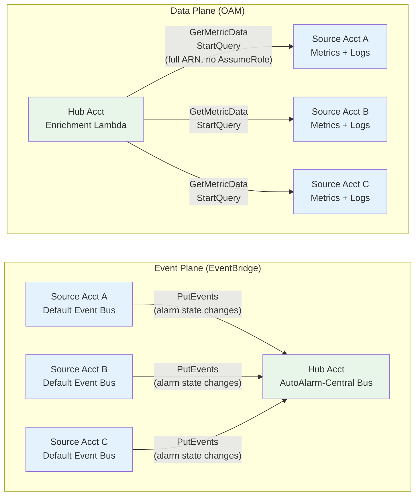

| Plane | Mechanism | Direction | Purpose |
|-------|-----------|-----------|---------|
| **Event** | EventBridge cross-account `PutEvents` | Source → Hub | Forward alarm state-change events |
| **Data** | OAM (read-sharing) | Hub → Source (reads) | Query logs, metrics from source accounts |

## 3. Enrichment Pipeline Dataflow

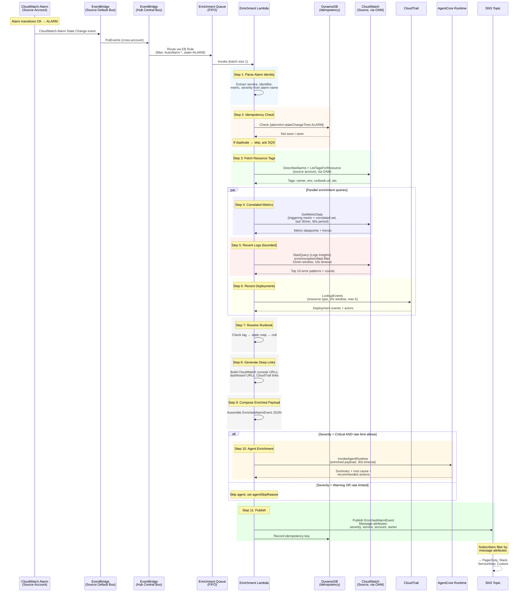

## 4. CDK Construct Hierarchy (Post-Changes)

```mermaid
graph TD
    APP["ExtendedApp"] --> STACK["AutoAlarmStack<br/>(ExtendedStack)"]
    STACK --> CONSTRUCT["AutoAlarmConstruct"]

    CONSTRUCT --> MAIN["AutoAlarm<br/>(MainHandler)"]
    CONSTRUCT --> SQS_H["SqsHandlerSubConstruct"]
    CONSTRUCT --> EVENTS["EventRules<br/>(14 services)"]

    CONSTRUCT -->|"enableReAlarm=true"| REALARM_C["ReAlarmConsumer"]
    CONSTRUCT -->|"enableReAlarm=true"| REALARM_P["ReAlarmProducer"]
    CONSTRUCT -->|"enableReAlarm=true"| REALARM_T["ReAlarmTagHandler"]

    CONSTRUCT -->|"enableOamSink=true"| OAM["OamSinkSubConstruct<br/><i>(NEW)</i>"]
    CONSTRUCT -->|"enableEnrichment=true"| ENRICH["EnrichmentSubConstruct<br/><i>(NEW)</i>"]

    subgraph "MainHandler (existing)"
        MAIN --> MAIN_FN["Lambda Function"]
        MAIN --> MAIN_Q["Main Queue (FIFO)"]
        MAIN --> MAIN_DLQ["Main DLQ"]
        MAIN --> MAIN_IAM["IAM Role"]
    end

    subgraph "SqsHandler (existing)"
        SQS_H --> SQS_FN["Lambda Function"]
        SQS_H --> SQS_QUEUES["14x Service Queues"]
    end

    subgraph "OAM Sink (NEW)"
        OAM --> OAM_SINK["CfnSink"]
        OAM --> OAM_POLICY["Sink Policy<br/>(org IDs / account IDs)"]
        OAM --> OAM_OUTPUT["Stack Output:<br/>Sink ARN"]
    end

    subgraph "Enrichment Pipeline (NEW)"
        ENRICH --> ENR_BUS["Custom EventBridge Bus<br/>(AutoAlarm-Central)"]
        ENRICH --> ENR_BUS_POLICY["Bus Resource Policy<br/>(allow PutEvents from sources)"]
        ENRICH --> ENR_RULE["EB Rule:<br/>Alarm State Change"]
        ENRICH --> ENR_Q["Enrichment Queue (FIFO)"]
        ENRICH --> ENR_DLQ["Enrichment DLQ"]
        ENRICH --> ENR_FN["Enrichment Lambda"]
        ENRICH --> ENR_IAM["IAM Role<br/>(CW read, Logs, CT,<br/>OAM, SNS, optional AgentCore)"]
        ENRICH --> ENR_SNS["SNS Topic<br/>(AutoAlarm-EnrichedAlarms)"]
        ENRICH --> ENR_DDB["DynamoDB Table<br/>(Idempotency)"]
    end

    style OAM fill:#fff3e0,stroke:#f57c00
    style ENRICH fill:#e8f5e9,stroke:#388e3c
    style MAIN fill:#e3f2fd,stroke:#1976d2
    style SQS_H fill:#e3f2fd,stroke:#1976d2
```

## 5. Source Account Deployment (StackSet)

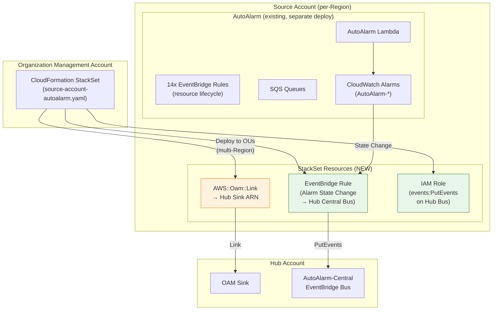

## 6. Regional Topology

OAM and EventBridge are both **per-Region**. Each Region is self-contained.

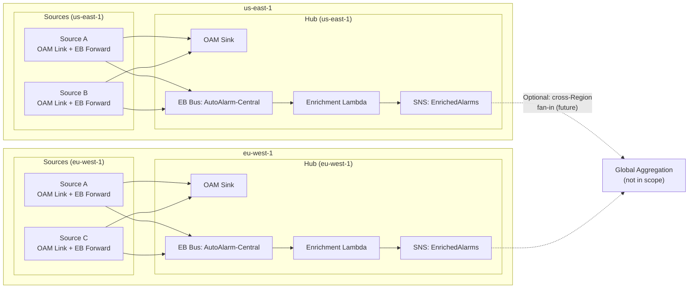

**Key constraints:**
- 1 OAM Sink per account per Region
- EventBridge cross-account only works within the same Region
- Each Region's enrichment pipeline operates independently
- Cross-Region aggregation is a future concern (SNS → SQS fan-in if needed)

## 7. IAM Permission Planes

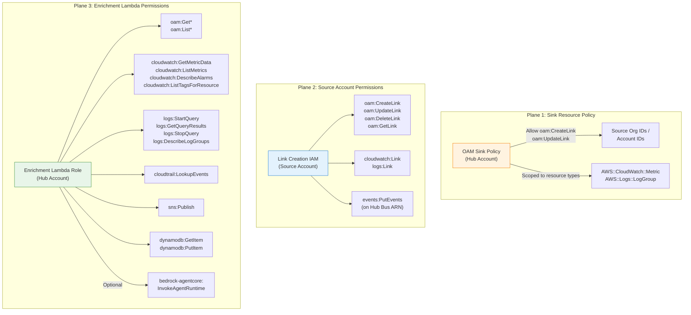

## 8. Enriched Alarm Payload Structure

```mermaid
graph TD
    ROOT["EnrichedAlarmEvent<br/>(v1.0)"]

    ROOT --> ALARM["alarm"]
    ROOT --> RESOURCE["resource"]
    ROOT --> CONTEXT["context"]
    ROOT --> LINKS["links"]
    ROOT --> ENRICHMENT["enrichment"]
    ROOT --> AGENT["agentSummary?"]

    ALARM --> A1["name, arn"]
    ALARM --> A2["state, previousState, reason"]
    ALARM --> A3["timestamp, severity"]
    ALARM --> A4["metric, namespace, alarmType"]
    ALARM --> A5["threshold, currentValue"]

    RESOURCE --> R1["service, identifier"]
    RESOURCE --> R2["account, region"]
    RESOURCE --> R3["tags (all resource tags)"]
    RESOURCE --> R4["owner, environment, application"]

    CONTEXT --> C1["correlatedMetrics[]<br/>(name, values[], trend, current, link)"]
    CONTEXT --> C2["recentErrors[] | null<br/>(message, count, firstSeen, lastSeen)"]
    CONTEXT --> C3["recentDeployments[]<br/>(eventName, timestamp, username, link)"]
    CONTEXT --> C4["runbookUrl | null"]

    LINKS --> L1["alarmConsole"]
    LINKS --> L2["metricsGraph"]
    LINKS --> L3["logsInsights | null"]
    LINKS --> L4["dashboard | null"]
    LINKS --> L5["runbook | null"]
    LINKS --> L6["cloudTrail"]

    ENRICHMENT --> E1["timestamp, version"]
    ENRICHMENT --> E2["idempotencyKey, durationMs"]
    ENRICHMENT --> E3["logsSkipped, logsSkipReason?"]
    ENRICHMENT --> E4["agentInvoked, agentSkipReason?"]
    ENRICHMENT --> E5["correlationWindow?<br/>(concurrentAlarms, relatedAlarmNames[])"]

    AGENT --> AG1["summary (2-3 sentences)"]
    AGENT --> AG2["rootCauseHypothesis"]
    AGENT --> AG3["recommendedActions[]"]
    AGENT --> AG4["confidence, source"]

    style ROOT fill:#f5f5f5,stroke:#333
    style ALARM fill:#e3f2fd,stroke:#1976d2
    style RESOURCE fill:#e8f5e9,stroke:#388e3c
    style CONTEXT fill:#fff3e0,stroke:#f57c00
    style LINKS fill:#fce4ec,stroke:#c62828
    style ENRICHMENT fill:#f3e5f5,stroke:#7b1fa2
    style AGENT fill:#fff8e1,stroke:#f9a825
```

### 8a. Expected JSON Payload: RDS Critical CPU Alarm (with agent fallback)

```json
{
  "version": "1.0",
  "alarm": {
    "name": "AutoAlarm-RDS-db1-CPUUtilization-Critical",
    "arn": "arn:aws:cloudwatch:us-east-1:111122223333:alarm:AutoAlarm-RDS-db1-CPUUtilization-Critical",
    "state": "ALARM",
    "previousState": "OK",
    "reason": "Threshold Crossed: 3 out of 3 datapoints [94.2, 96.1, 97.8] were greater than the threshold (90.0)",
    "timestamp": "2026-03-30T14:23:00Z",
    "severity": "Critical",
    "metric": "CPUUtilization",
    "namespace": "AWS/RDS",
    "alarmType": "static",
    "threshold": 90.0,
    "currentValue": null
  },
  "resource": {
    "service": "RDS",
    "identifier": "db1",
    "account": "111122223333",
    "region": "us-east-1",
    "tags": {
      "autoalarm:enabled": "true",
      "autoalarm:cpu": "90",
      "autoalarm:runbook-url": "https://wiki.internal/runbooks/rds-high-cpu",
      "autoalarm:dashboard-url": "https://grafana.internal/d/rds-overview?var-instance=db1",
      "owner": "payments-team",
      "environment": "production",
      "application": "checkout-api"
    },
    "owner": "payments-team",
    "environment": "production",
    "application": "checkout-api"
  },
  "context": {
    "correlatedMetrics": [
      {
        "name": "DatabaseConnections",
        "namespace": "AWS/RDS",
        "values": [45, 48, 52, 67, 89, 124, 156, 178, 192, 201],
        "trend": "rising",
        "current": 201,
        "link": "https://us-east-1.console.aws.amazon.com/cloudwatch/home?region=us-east-1#metricsV2:graph=~(metrics~(~(~'AWS*2fRDS~'DatabaseConnections~'DBInstanceIdentifier~'db1))~view~'timeSeries~region~'us-east-1~stat~'Average~period~60)"
      },
      {
        "name": "FreeableMemory",
        "namespace": "AWS/RDS",
        "values": [2147483648, 1879048192, 1073741824, 805306368, 536870912, 402653184, 268435456, 201326592, 150994944, 134217728],
        "trend": "falling",
        "current": 134217728,
        "link": "https://us-east-1.console.aws.amazon.com/cloudwatch/home?region=us-east-1#metricsV2:graph=~(metrics~(~(~'AWS*2fRDS~'FreeableMemory~'DBInstanceIdentifier~'db1))~view~'timeSeries~region~'us-east-1~stat~'Average~period~60)"
      },
      {
        "name": "DiskQueueDepth",
        "namespace": "AWS/RDS",
        "values": [0.1, 0.2, 0.3, 0.8, 1.2, 2.4, 3.1, 4.7, 5.2, 6.8],
        "trend": "rising",
        "current": 6.8,
        "link": "https://us-east-1.console.aws.amazon.com/cloudwatch/home?region=us-east-1#metricsV2:graph=~(metrics~(~(~'AWS*2fRDS~'DiskQueueDepth~'DBInstanceIdentifier~'db1))~view~'timeSeries~region~'us-east-1~stat~'Average~period~60)"
      }
    ],
    "recentErrors": null,
    "recentDeployments": [
      {
        "eventName": "ModifyDBInstance",
        "timestamp": "2026-03-30T13:38:00Z",
        "username": "deploy-role/checkout-pipeline",
        "sourceIPAddress": "10.0.1.42",
        "link": "https://us-east-1.console.aws.amazon.com/cloudtrailv2/home?region=us-east-1#/events/abc123"
      }
    ],
    "runbookUrl": "https://wiki.internal/runbooks/rds-high-cpu"
  },
  "links": {
    "alarmConsole": "https://us-east-1.console.aws.amazon.com/cloudwatch/home?region=us-east-1#alarmsV2:alarm/AutoAlarm-RDS-db1-CPUUtilization-Critical",
    "metricsGraph": "https://us-east-1.console.aws.amazon.com/cloudwatch/home?region=us-east-1#metricsV2:graph=~(metrics~(~(~'AWS*2fRDS~'CPUUtilization~'DBInstanceIdentifier~'db1))~view~'timeSeries~region~'us-east-1~stat~'Average~period~60)",
    "logsInsights": null,
    "dashboard": "https://grafana.internal/d/rds-overview?var-instance=db1",
    "runbook": "https://wiki.internal/runbooks/rds-high-cpu",
    "cloudTrail": "https://us-east-1.console.aws.amazon.com/cloudtrailv2/home?region=us-east-1#/events?ResourceName=db1"
  },
  "enrichment": {
    "timestamp": "2026-03-30T14:23:04.312Z",
    "version": "1.0",
    "idempotencyKey": "arn:aws:cloudwatch:us-east-1:111122223333:alarm:AutoAlarm-RDS-db1-CPUUtilization-Critical:2026-03-30T14:23:00Z:ALARM",
    "durationMs": 4312,
    "logsSkipped": true,
    "logsSkipReason": "no_log_group",
    "agentInvoked": false,
    "agentSkipReason": "disabled",
    "correlationWindow": {
      "concurrentAlarms": 2,
      "relatedAlarmNames": [
        "AutoAlarm-RDS-db1-CPUUtilization-Critical",
        "AutoAlarm-RDS-db1-DatabaseConnections-Warning"
      ]
    }
  },
  "agentSummary": {
    "summary": "Critical alarm on RDS/db1: CPUUtilization crossed threshold.",
    "rootCauseHypothesis": "Unable to generate hypothesis (agent unavailable).",
    "recommendedActions": [
      "Check runbook: https://wiki.internal/runbooks/rds-high-cpu",
      "Review correlated metrics and recent deployments in the enriched payload."
    ],
    "confidence": "low",
    "source": "fallback"
  }
}
```

### 8b. Expected JSON Payload: EC2 Warning (degraded — no correlated metrics)

```json
{
  "version": "1.0",
  "alarm": {
    "name": "AutoAlarm-EC2-i-0abc123def-CPUUtilization-Warning",
    "arn": "arn:aws:cloudwatch:us-west-2:444455556666:alarm:AutoAlarm-EC2-i-0abc123def-CPUUtilization-Warning",
    "state": "ALARM",
    "previousState": "OK",
    "reason": "Threshold Crossed: 3 out of 3 datapoints [82.1, 83.5, 84.0] were greater than the threshold (80.0)",
    "timestamp": "2026-03-30T09:15:00Z",
    "severity": "Warning",
    "metric": "CPUUtilization",
    "namespace": "AWS/EC2",
    "alarmType": "static",
    "threshold": null,
    "currentValue": null
  },
  "resource": {
    "service": "EC2",
    "identifier": "i-0abc123def",
    "account": "444455556666",
    "region": "us-west-2",
    "tags": {
      "autoalarm:enabled": "true",
      "Name": "web-server-03",
      "owner": "frontend-team",
      "environment": "staging"
    },
    "owner": "frontend-team",
    "environment": "staging",
    "application": null
  },
  "context": {
    "correlatedMetrics": [],
    "recentErrors": null,
    "recentDeployments": [],
    "runbookUrl": null
  },
  "links": {
    "alarmConsole": "https://us-west-2.console.aws.amazon.com/cloudwatch/home?region=us-west-2#alarmsV2:alarm/AutoAlarm-EC2-i-0abc123def-CPUUtilization-Warning",
    "metricsGraph": "https://us-west-2.console.aws.amazon.com/cloudwatch/home?region=us-west-2#metricsV2:graph=~(metrics~(~(~'AWS*2fEC2~'CPUUtilization~'InstanceId~'i-0abc123def))~view~'timeSeries~region~'us-west-2~stat~'Average~period~60)",
    "logsInsights": null,
    "dashboard": null,
    "runbook": null,
    "cloudTrail": "https://us-west-2.console.aws.amazon.com/cloudtrailv2/home?region=us-west-2#/events?ResourceName=i-0abc123def"
  },
  "enrichment": {
    "timestamp": "2026-03-30T09:15:02.156Z",
    "version": "1.0",
    "idempotencyKey": "arn:aws:cloudwatch:us-west-2:444455556666:alarm:AutoAlarm-EC2-i-0abc123def-CPUUtilization-Warning:2026-03-30T09:15:00Z:ALARM",
    "durationMs": 2156,
    "logsSkipped": true,
    "logsSkipReason": "no_log_group",
    "agentInvoked": false,
    "agentSkipReason": "severity_filtered"
  }
}
```

### 8c. SNS Message Attributes (subscriber filtering)

| Attribute | Type | Always Present | Example Values |
|-----------|------|----------------|----------------|
| `schemaVersion` | String | Yes | `"1.0"` |
| `severity` | String | Yes | `"Critical"`, `"Warning"` |
| `service` | String | Yes | `"EC2"`, `"RDS"`, `"ALB"` |
| `sourceAccount` | String | Yes | `"111122223333"` |
| `region` | String | Yes | `"us-east-1"` |
| `environment` | String | No (from tag) | `"production"`, `"staging"` |
| `owner` | String | No (from tag) | `"payments-team"` |
| `hasAgentSummary` | String | Yes | `"true"`, `"false"` |
| `isDegraded` | String | Yes | `"true"` if any enrichment step failed |

## 9. Existing vs New Components

```
AutoAlarm-2 Component Map
=========================

EXISTING (unchanged)                          NEW (this plan)
--------------------------------------------  ------------------------------------------
cdk/bin/auto-alarm.ts .................. MOD   cdk/lib/oam-sink-subconstruct.ts ..... NEW
cdk/lib/auto-alarm-stack.ts ........... MOD   cdk/lib/enrichment-subconstruct.ts ... NEW
cdk/lib/auto-alarm-construct.ts ....... MOD   handlers/src/enrichment-handler.mts .. NEW
cdk/lib/main-function-subsconstruct.ts  OK    handlers/src/types/enrichment-types.mts NEW
cdk/lib/realarm-producer-subconstruct   OK    handlers/src/types/enrichment-schemas.mts NEW
cdk/lib/realarm-consumer-subconstruct   OK    cloudformation/source-account-
cdk/lib/realarm-tag-event-subconstruct  OK      autoalarm.yaml ................... NEW
cdk/lib/service-eventbridge-subconstruct OK
cdk/lib/sqs-handler-subconstruct.ts ... OK    Agent (separate deployment):
cdk/lib/extended-libs-subconstruct.ts   OK    bedrock-agentcore-agent/ ............. FUTURE
handlers/src/main-handler.mts ........ OK       (Python/Strands, own lifecycle)
handlers/src/sqs-handler.mts ......... OK
handlers/src/realarm-*.mts ........... OK
handlers/src/alarm-configs/utils/
  alarm-tools.mts .................... MOD     MOD = modified
  valibot-schemas.mts ................ OK      OK  = no changes
handlers/src/service-modules/*.mts ... OK      NEW = new file
handlers/src/alarm-configs/*.mts ..... OK
handlers/package.json ................ MOD

Infrastructure alarms (created by enrichment-subconstruct.ts):
  Enrichment-DLQ-Depth-Warning   — DLQ ≥ 1 message
  Enrichment-DLQ-Depth-Critical  — DLQ ≥ 50 messages
  Enrichment-Queue-Age-Warning   — Oldest message ≥ 5 min (300s)
  Enrichment-Queue-Age-Critical  — Oldest message ≥ 15 min (900s)
```

## 10. Deployment Sequence

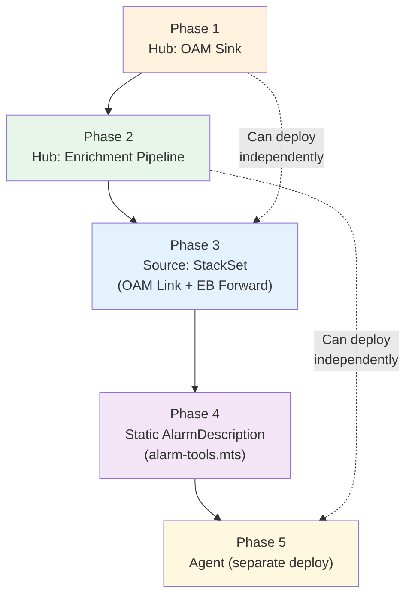

| Phase | What | Depends on |
|-------|------|------------|
| 1 | OAM Sink in hub account | Nothing |
| 2 | Enrichment pipeline (EB bus, Lambda, SQS, SNS, DynamoDB) | Nothing (works without OAM if local-account only) |
| 3 | Source account StackSet (OAM Link + EB forwarding rule) | Phases 1 + 2 (needs sink ARN + bus ARN) |
| 4 | Static AlarmDescription at creation time | Nothing (independent improvement) |
| 5 | AgentCore agent deployment | Phase 2 (needs enrichment Lambda to invoke it) |

## 11. Failure Handling Flow

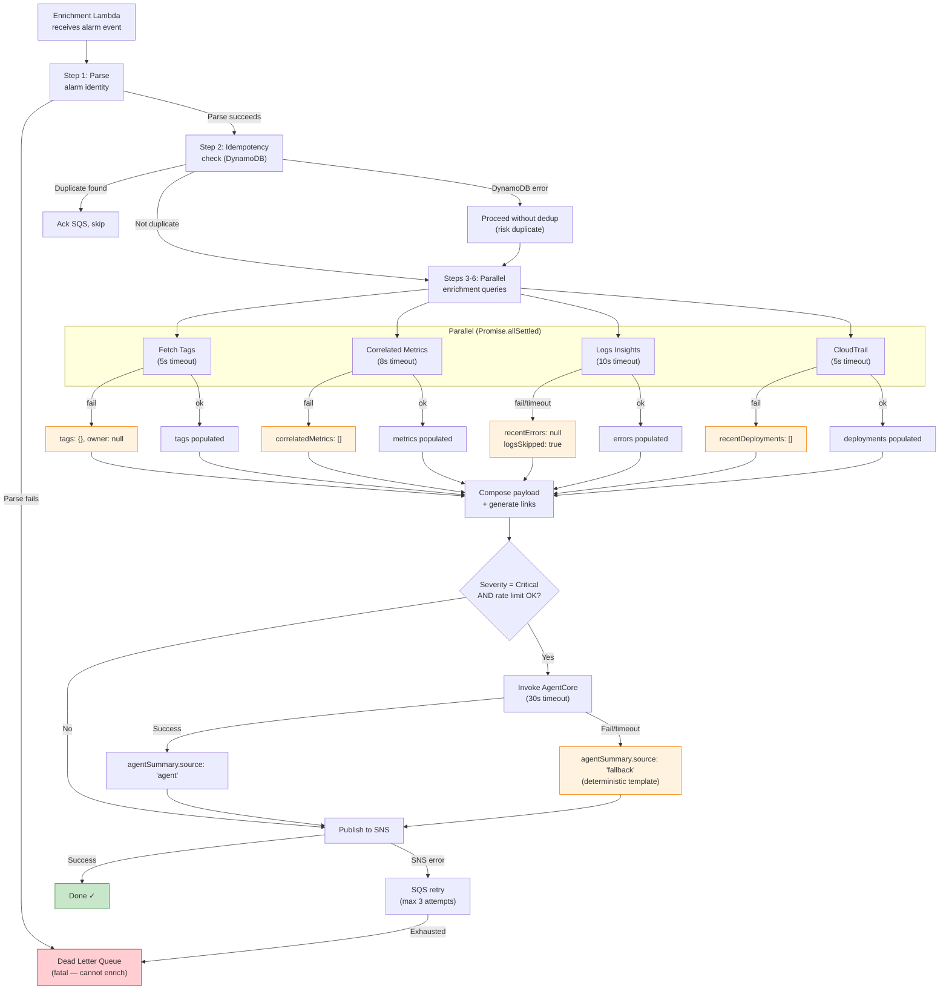

## 12. Backpressure and Alarm Storm Handling

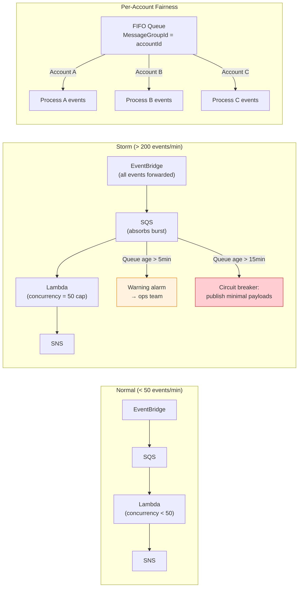

## 13. Observability of the Enrichment System

```mermaid
graph TD
    subgraph "Enrichment Lambda emits"
        M1["EnrichmentDuration<br/>(ms, by service/severity)"]
        M2["EnrichmentStepDuration<br/>(ms, by step)"]
        M3["EnrichmentSuccess / Degraded / Failed<br/>(count)"]
        M4["AgentInvoked / Success / Fallback<br/>(count)"]
        M5["IdempotencyHit<br/>(count)"]
        M6["MissingOwnerTag / MissingRunbook<br/>(count by account/service)"]
    end

    subgraph "AWS-native metrics"
        M7["Lambda: Duration, Errors,<br/>Throttles, Concurrent"]
        M8["SQS: MessageAge, MessageCount,<br/>DLQ Depth"]
        M9["SNS: Published, Failed"]
    end

    subgraph "CloudWatch Dashboard:<br/>AutoAlarm-Enrichment-Operations"
        P1["Throughput<br/>(stacked area)"]
        P2["Latency<br/>(p50/p90/p99)"]
        P3["Per-step latency<br/>(heatmap)"]
        P4["Queue health"]
        P5["Agent usage"]
        P6["Degradation rate"]
        P7["Metadata coverage"]
        P8["Lambda health"]
    end

    M1 & M2 & M3 --> P1 & P2 & P3 & P6
    M4 --> P5
    M5 & M6 --> P7
    M7 --> P8
    M8 --> P4

    subgraph "Alarms on Enrichment"
        A1["Error rate > 10/5min → Critical"]
        A2["p99 latency > 30s → Warning"]
        A3["Queue age > 5min → Warning"]
        A4["Queue age > 15min → Critical"]
        A5["DLQ depth > 0 → Warning"]
        A6["Agent fallback > 50% → Warning"]
    end

    M3 --> A1
    M1 --> A2
    M8 --> A3 & A4 & A5
    M4 --> A6
```

## 14. Rollout Stages

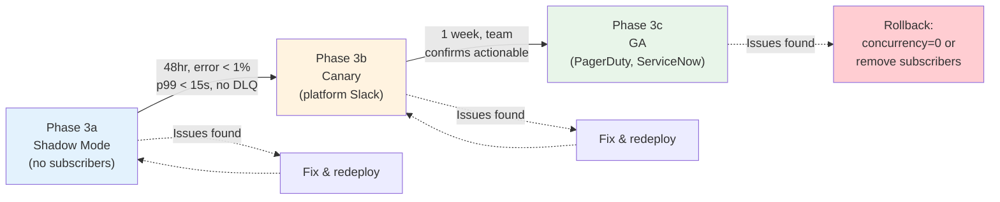
